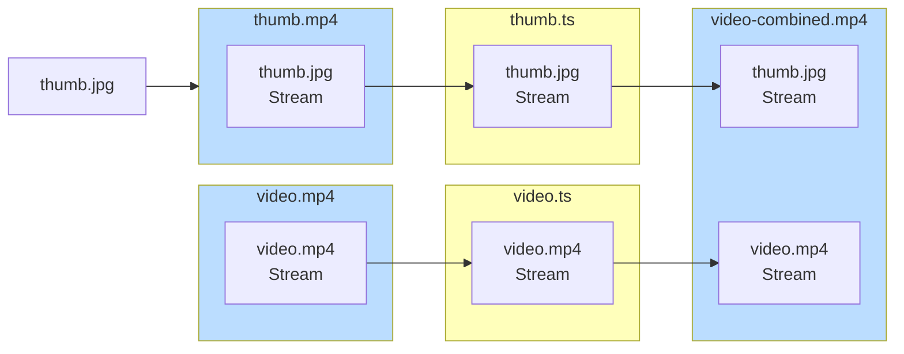

# `ffmpeg-insert-first-frame.sh`

Inserts a given thumbnail image to a video file.  
Without reencoding or messing with the video!

## Usage

```bash
./ffmpeg-insert-first-frame.sh thumb.jpg video.mp4
    Codec: hevc
Dimension: 1702x952
Framerate: 60.00000000000000000000

==> Generating single frame thumbnail video... ✅

==> Converting videos to MPEG-TS container...
Thumb... ✅
Video... ✅

==> Concatenating... ✅

Done!
Output: video-combined.mp4

```

## Details
This works by remuxing the video container format to MPEG-TS, which can be concatenated nicely with `ffmpeg`.  
An MP4 video with HEVC/H264 can be trivially remuxed to MPEG-TS, so this is very nice.




